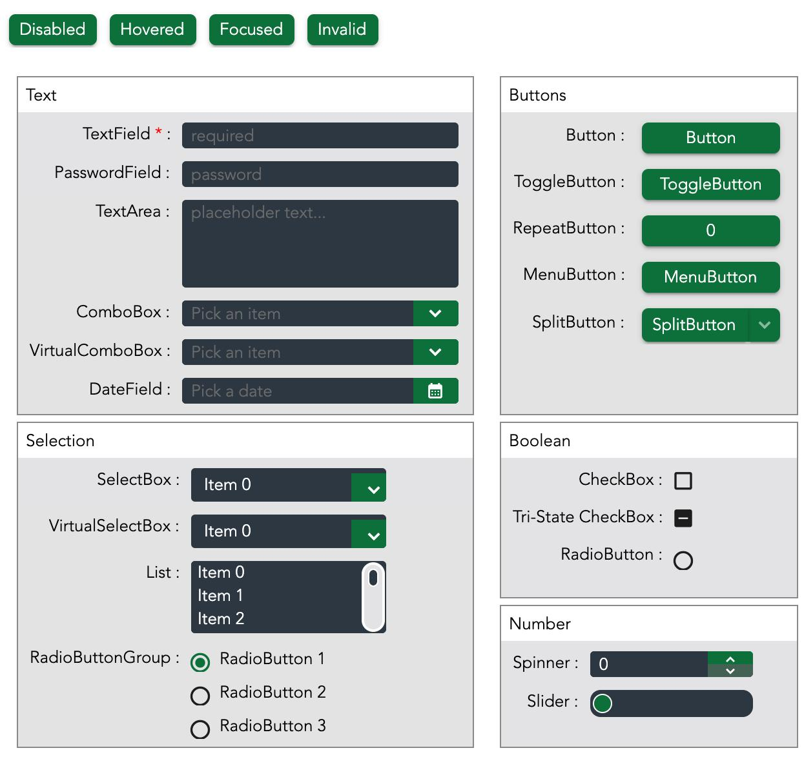
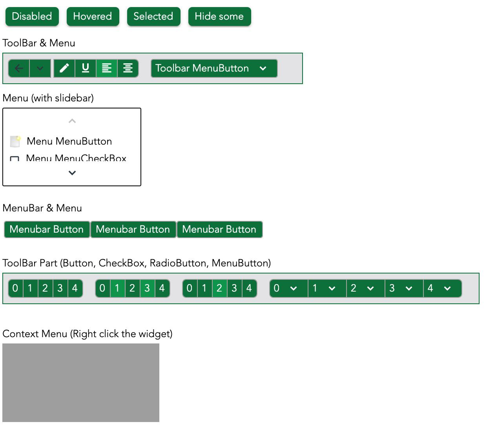

# About
A modern-looking theme for Qooxdoo.
Comes with three variants: main green theme (zx.ui.theme.avocado.Avocado), red variant (zx.ui.theme.avocado.AvocadoRed), and blue variant (zx.ui.theme.avocado.AvocadoBlue)

# How it looks

# Demo
This repo includes a demo where you can see the theme in action. 
To see it in action, clone this repository, `cd` into this repo's directory, and run `qx serve`.
Then open `localhost:8080` in your browser.

# Installation
- Ensure you cloned this repo
- In your Qooxdoo project, add the path to the root folder of this repo to the `libraries` section in your compile.json
- In `compile.json`, add the following line into your application in the `applications` section: `theme: zx.ui.theme.avocado.Avocado`
  *For the blue variant of the theme, instead add `theme: zx.ui.theme.avocado.AvocadoBlue` and for the red variant of the theme, it's `theme: zx.ui.theme.avocado.AvocadoRed`*
